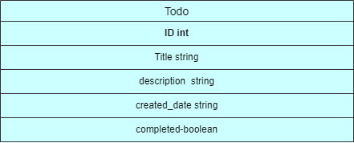
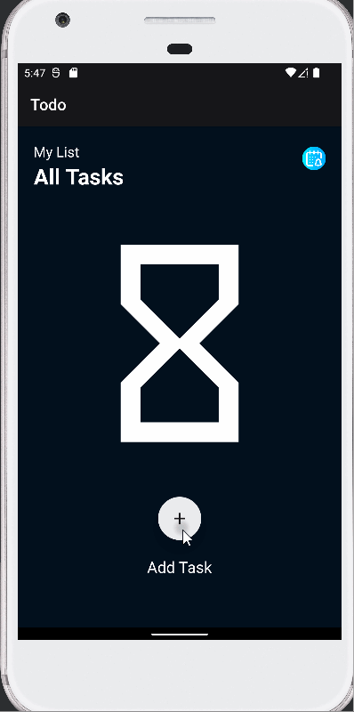
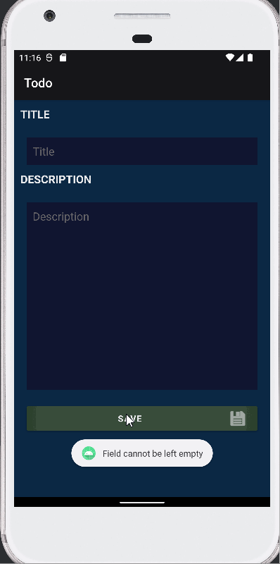
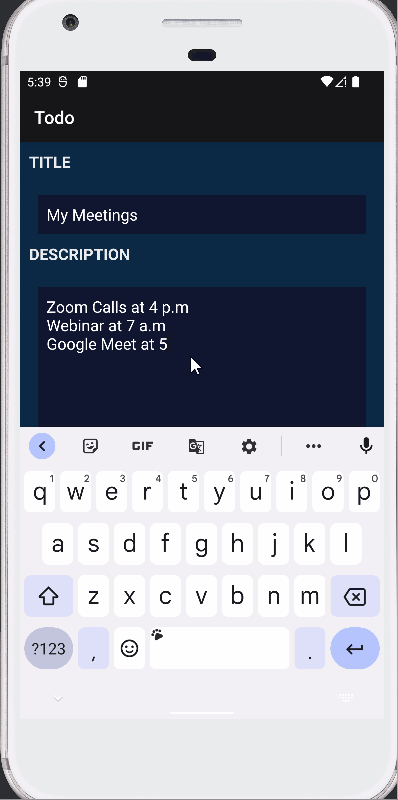
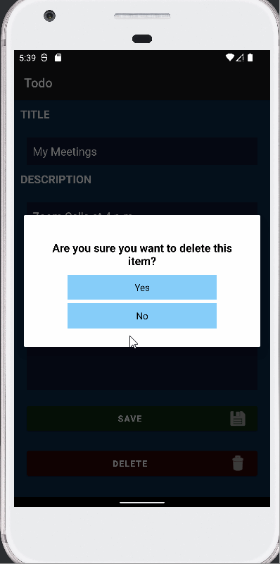
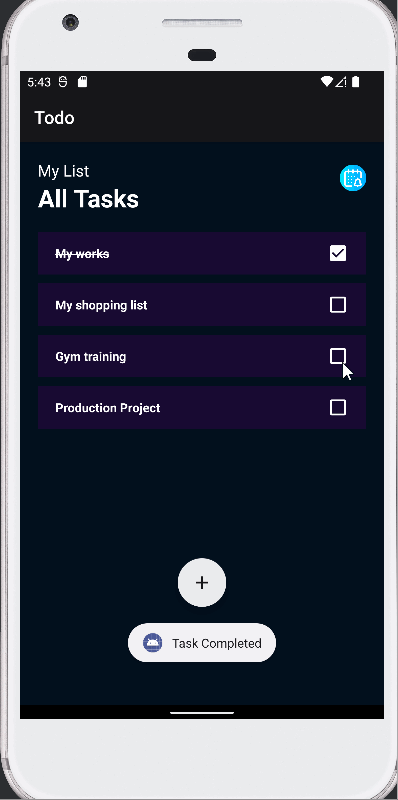
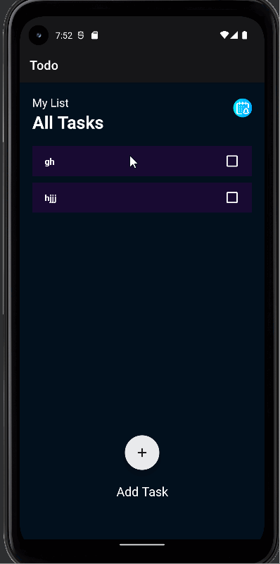

# Final ToDo list Application

## Database Architecture

**The figure below shows the Room database architecture followed while building this project**

**The figure below shows the erd of the database**

### Add New Task  and save with a popup

### Empty fields not accepted

### Update task

### Delete Task with popup

### Check finished task

### Reordering the task

